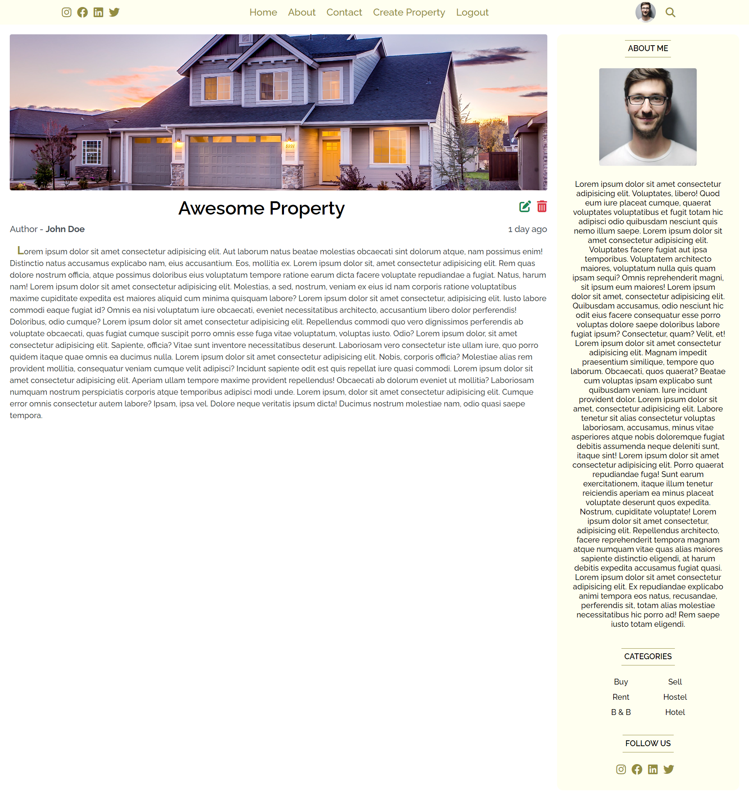
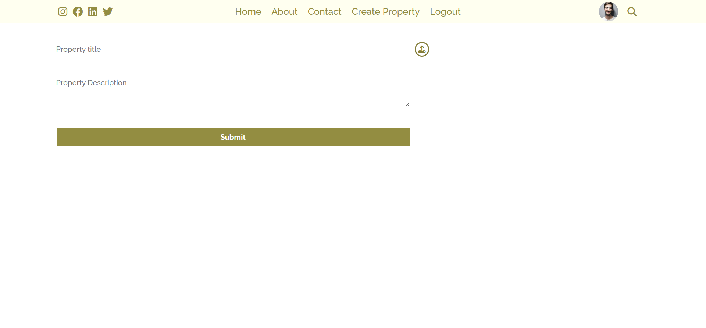

# ReactJS Listing Marketplace Application

A modern Listing Marketplace Application built with React.js. This application allows users to browse listings, view details, and create new property listings.

## Features

- **Home Page**: A visually appealing landing page showcasing featured properties.
- **Listing Details**: Detailed view of each property including descriptions and agent information.
- **Create Listing**: A form interface to submit new property listings.
- **Responsive Design**: Optimized for various screen sizes.

## Screenshots

### Home Page


### Detail Page



### Create Page



## Technologies Used

- **React.js**: Frontend library for building user interfaces.
- **React Router DOM**: For handling client-side routing.
- **CSS**: Custom styling for the application components.

## Installation and Setup

To run this project locally, follow these steps:

1. **Clone the repository**

    ```bash
    git clone https://github.com/aadhar41/reactjs-listing-marketplace-application.git
    cd reactjs-listing-marketplace-application
    ```

2. **Install Dependencies**

    ```bash
    npm install
    ```

3. **Start the Development Server**

    ```bash
    npm start
    ```

    The app will run in development mode. Open [http://localhost:3000](http://localhost:3000) to view it in your browser.

## Scripts

- `npm start`: Runs the app in the development mode.
- `npm test`: Launches the test runner.
- `npm run build`: Builds the app for production to the `build` folder.

## License

This project is private and intended for educational/portfolio purposes.
